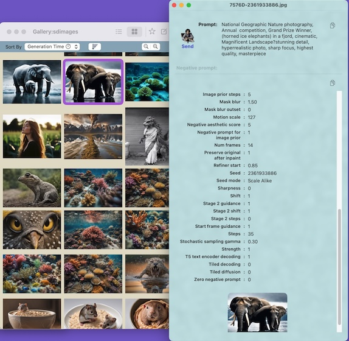

# PromptReaderClient

A lightweight Swift client for integrating [PromptReader](link-to-promptreader) into your macOS application. PromptReader is a floating inspector window that displays AI image generation parameters. This client class makes it easy to send images to PromptReader for inspection.


## Basic Usage
For an image gallery or browser app, PromptReader can float above and display detailed info on the currently selected image. To have PR track the current selection, pass its URL to the PromptReaderClient object

```swift
// Initialize the client
let promptReader = PromptReaderClient()

// Display a file in PromptReader
func selectionDidChange(_ url: URL) {
    promptReader.inspect(url)
}
```


## Features

- Simple API for displaying files in PromptReader
- Automatic checks for App availability
- User preference management
- SwiftUI support

## Installation

Add PromptReaderClient.swift to your Xcode project. That's all.

## SwiftUI Integration

Add a user preference toggle to your settings:

```swift
@AppStorage("callPromptReader") var callPromptReader = promptReader.isAppInstalled

Toggle("Show Image Settings in PromptReader", isOn: $callPromptReader)
    .disabled(!promptReader.isAppInstalled)
    .help(promptReader.isAppInstalled ?
          "Show full image settings using companion app, PromptReader" :
          "PromptReader is not installed")
```

## Requirements

- macOS 10.15 or later
- PromptReader, [available on TestFlight](https://testflight.apple.com/join/ATw6nFGv)

## License

MIT License. See [LICENSE](LICENSE) file for details.


## Contributing

Pull requests are welcome. For major changes, please open an issue first to discuss what you would like to change.
